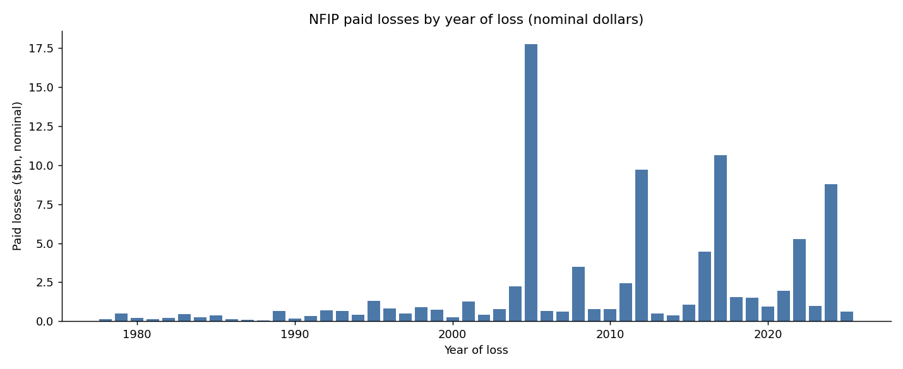

# NFIP exploratory analysis

Everything below is computed from the real OpenFEMA files loaded by `src/build_db.py`.

## 1. Shape

|      claims |   first_year |   last_year |   error_records |   zero_paid |   total_paid_bn |
|------------:|-------------:|------------:|----------------:|------------:|----------------:|
| 2.72599e+06 |         1978 |        2026 |          117748 |      608663 |           89.86 |

## 2. Field completeness

How much of each field is unusable. Anything above ~30% missing cannot carry a dashboard filter.

| field             |   pct_missing |
|:------------------|--------------:|
| building_damage   |         21.82 |
| payment_date      |         20.8  |
| water_depth       |          8.7  |
| rated_flood_zone  |          5.1  |
| building_coverage |          2.87 |
| occupancy_type    |          0.02 |

## 3. Occupancy mapping coverage

If 'Unknown' is large, there are occupancy codes the mapping does not handle - check the data dictionary before trusting any segment cut.

| occupancy_group                |   claims |   pct |
|:-------------------------------|---------:|------:|
| Single family                  |  2211759 | 81.14 |
| Non-residential                |   231429 |  8.49 |
| Residential 2-4 units          |   149911 |  5.5  |
| Residential 5+ / condo assoc   |   111951 |  4.11 |
| Residential unit in multi-unit |    10721 |  0.39 |
| Mobile / manufactured home     |     9524 |  0.35 |
| Unknown                        |      572 |  0.02 |
| Non-residential mobile home    |      122 |  0    |

## 4. The headline question: where do the dollars come from?

| zone_class          |   claims |   paid_bn |   pct_paid |
|:--------------------|---------:|----------:|-----------:|
| SFHA - Standard (A) |  1734221 |     65.34 |       72.9 |
| Non-SFHA (B/C/X)    |   648069 |     20.68 |       23.1 |
| SFHA - Velocity (V) |    87227 |      2.91 |        3.2 |
| Unknown             |   134570 |      0.68 |        0.8 |
| Undetermined (D)    |     4154 |      0.06 |        0.1 |

## 5. Loss is catastrophe-driven, not steady

The eight worst loss years. If a handful of years dominate, then any 'average year' framing in the dashboard is misleading and the design has to show the spikes.

|   year_of_loss |   claims |   paid_bn |
|---------------:|---------:|----------:|
|           2005 |   253437 |    17.733 |
|           2017 |   138020 |    10.65  |
|           2012 |   170754 |     9.719 |
|           2024 |    97213 |     8.799 |
|           2022 |    56356 |     5.252 |
|           2016 |    82029 |     4.467 |
|           2008 |    93695 |     3.489 |
|           2011 |    92995 |     2.429 |

## 6. Severity is heavily skewed

Mean vs median tells you whether to use averages anywhere in the dashboard.

|   p50 |   p75 |    p90 |    p99 |    max_paid |   mean_paid |
|------:|------:|-------:|-------:|------------:|------------:|
| 13146 | 49918 | 118774 | 336722 | 1.08415e+07 |       42634 |

## 7. Why claims close unpaid

Watch for 'Unmapped' rows - those are codes missing from the lookup.

| reason                                |   claims |   pct |
|:--------------------------------------|---------:|------:|
| Other                                 |   130861 | 21.71 |
| Claim below deductible                |   127327 | 21.13 |
| Not an actual flood                   |   118316 | 19.63 |
| No demonstrable damage                |    80372 | 13.34 |
| Erroneous assignment                  |    48752 |  8.09 |
| Error - delete claim (no assignment)  |    37520 |  6.23 |
| Failure to pursue claim               |    22064 |  3.66 |
| Not insured, wind damage              |    14153 |  2.35 |
| Seepage                               |     7686 |  1.28 |
| Backup of drains                      |     2724 |  0.45 |
| Sea wall                              |     2709 |  0.45 |
| Boat piers                            |     1813 |  0.3  |
| Erosion type outside flood definition |     1376 |  0.23 |
| Fence damage                          |     1372 |  0.23 |
| Loss in progress                      |     1194 |  0.2  |

## 8. Claim cycle time

|   median_days |   p90_days |   pct_over_year |   claims_with_dates |
|--------------:|-----------:|----------------:|--------------------:|
|            76 |        264 |             6.6 |         2.13363e+06 |

## 9. Loss ratio

Skipped - policies were not loaded. Re-run `src/build_db.py` without `--skip-policies`.
